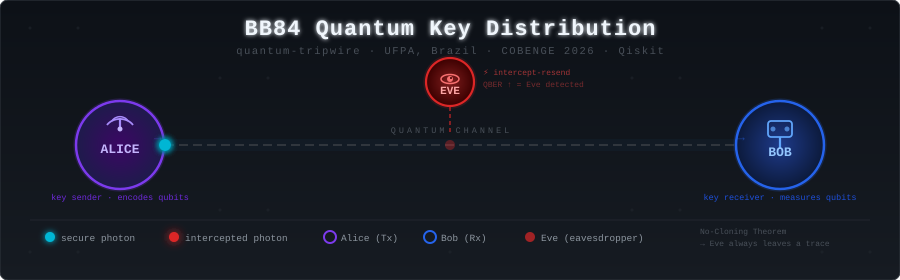
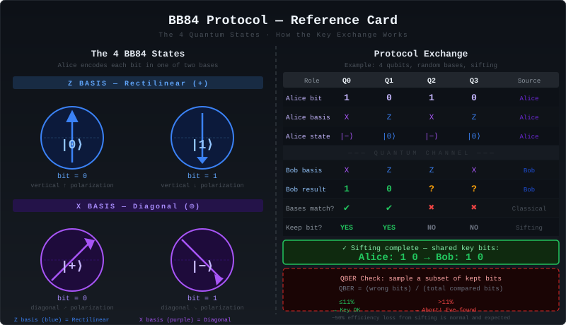
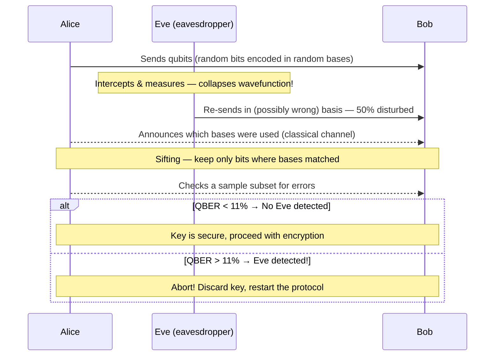

<div align="center">
  
</div>

<div align="center">

# quantum-cryptography-bb84

### The laws of physics as a burglar alarm

[](https://python.org)
[](https://qiskit.org)
[](https://github.com/Qiskit/qiskit-aer)
[](https://cobenge.abenge.org.br/)
[](https://ufpa.br)

**BB84 Quantum Key Distribution — simulation, NISQ hardware noise, and a novel partial Eve attack.**

[Run the Code](#how-to-run) · [See Results](#experiments--results) · [Read the Article](docs/artigo.md) · [Presentation Slides](docs/apresentacao.md)

</div>

---

## What is BB84?

Forget math-based encryption. BB84 (Bennett & Brassard, 1984) secures communication using **the laws of quantum mechanics** — no math problem to crack, no key to steal.

- **Observation collapses quantum states.** A photon exists in superposition until it is measured. The act of reading it *destroys the original state* and produces a detectable error.
- **You cannot copy a qubit.** The [No-Cloning Theorem](https://en.wikipedia.org/wiki/No-cloning_theorem) proves it is physically impossible for an eavesdropper to copy a quantum state without leaving a trace.
- **Nature is the alarm system.** If Eve intercepts even one photon, her presence statistically raises the Quantum Bit Error Rate (QBER). Alice and Bob detect the intrusion, discard the key, and start over.

> Think of it this way: the key is written in pencil on paper that turns to ash the moment anyone besides the intended recipient touches it.

---

## Protocol at a Glance

<div align="center">
  
</div>

### Step-by-Step Flow



---

## Experiments & Results

This project runs **4 experimental scenarios** in Qiskit, progressing from an ideal noiseless simulator through real NISQ hardware noise, ending with a novel partial-attack contribution.

| # | Scenario | Eve? | NISQ Noise? | QBER | Origin |
|---|----------|:----:|:-----------:|:----:|--------|
| 1 | Ideal Simulator | No | No | **`0.00%`** | IEEE Replication |
| 2 | Total Eve Attack (intercept-resend) | Yes — 100% | No | **`37.48%`** | IEEE Replication |
| 3 | NISQ Hardware Noise | No | Yes | **`2.28%`** | IEEE Replication |
| 4 | **Partial Eve Attack on NISQ** | **Yes — 50%** | **Yes** | **`2.12%`** | **Novel Contribution** |
| 5 | **Partial Eve Attack (Google Cirq)** | **Yes — 50%** | **Yes** | **`7.24%`** | **Cross-Validation** |

### QBER at a Glance

```
Scenario 2 — Total Eve Attack       ████████████████████████████████████████  37.48%
Scenario 5 — Partial Eve (Google)   ███████░░░░░░░░░░░░░░░░░░░░░░░░░░░░░░░░░   7.24%  ◄ CROSS-VALIDATION
Scenario 3 — NISQ Noise Only        ██░░░░░░░░░░░░░░░░░░░░░░░░░░░░░░░░░░░░░░   2.28%
Scenario 4 — Partial Eve on NISQ    ██░░░░░░░░░░░░░░░░░░░░░░░░░░░░░░░░░░░░░░   2.12%  ◄ NOVEL
Scenario 1 — Ideal (No Eve)         ░░░░░░░░░░░░░░░░░░░░░░░░░░░░░░░░░░░░░░░░   0.00%
```

The 7 generated output figures (in `figures/`) document each scenario with IEEE-style probability histograms and a final comparative QBER bar chart.

---

## Novel Contribution

<details>
<summary><strong>The Partial Eve Attack on NISQ Hardware (click to expand)</strong></summary>

<br/>

The base paper (Saeed et al., IEEE 2023) replicates BB84 on real IBM quantum hardware and demonstrates total Eve attack detection. Our contribution extends this analysis with a new research question:

**What happens when Eve intercepts only *half* the qubits on a real NISQ device?**

**Hypothesis:** A partial attacker (intercepting 2 of 4 qubits = 50%) on NISQ hardware operates in a compressed detection window. The hardware's natural noise floor (~2.28% QBER) could potentially camouflage a sufficiently stealthy partial attacker.

**Result:** The partial attack produced a QBER of **2.12%**, which is within the hardware noise baseline of 2.28%. This suggests that on this particular run, the partial attacker is effectively camouflaged by the natural NISQ noise, making detection statistically challenging. The Google Cirq cross-validation yielded **7.24%**, indicating variance across simulation frameworks.

**Implication:** In real-world NISQ deployments, partial adversaries represent a distinct threat profile. As hardware noise increases (lower-quality QPUs), the detection margin shrinks further. This motivates stronger statistical thresholds in the classical post-processing phase of BB84 for near-term quantum networks.

The partial attack is implemented by targeting only qubits 0 and 1:

```python
# Eve intercepts only half the qubits (novel contribution)
qc_proposta = ataque_eve(qc_proposta, bases_eve_parcial, qubits_alvo=[0, 1])
```

The noise model uses 5% depolarizing error on all single-qubit gates (`u1`, `u2`, `u3`, `x`, `h`) to simulate the decoherence of real NISQ hardware (ibmqx2 family).

</details>

---
# File Tree
```
├── 📁 assets
│   ├── 🖼️ banner.svg
│   └── 🖼️ bb84-protocol.svg
├── 📁 docs
│   ├── 📄BB84_Security_on_IBM_Quantum_Hardware.pptx
│   ├── 📄 Qiskit_BB84_Implementation.pptx
│   ├── 📝 artigo.md
│   └── 📝 objetivo.md
├── 📁 figures
│   ├── 📕 fig0_circuito_bb84_base-1.pdf
│   ├── 🖼️ fig0_circuito_bb84_base-1.png
│   ├── 📕 fig1_simulador_ideal-1.pdf
│   ├── 🖼️ fig1_simulador_ideal-1.png
│   ├── 📕 fig2_simulador_eve_total-1.pdf
│   ├── 🖼️ fig2_simulador_eve_total-1.png
│   ├── 📕 fig3_hardware_natural-1.pdf
│   ├── 🖼️ fig3_hardware_natural-1.png
│   ├── 📕 fig4_hardware_ataque_parcial-2.pdf
│   ├── 🖼️ fig4_hardware_ataque_parcial-2.png
│   ├── 📕 fig4a_circuito_nossa_proposta-1.pdf
│   ├── 🖼️ fig4a_circuito_nossa_proposta-1.png
│   ├── 📕 fig5_google_cirq_parcial-1.pdf
│   ├── 🖼️ fig5_google_cirq_parcial-1.png
│   ├── 📕 fig6_diferencas_qber-2.pdf
│   ├── 🖼️ fig6_diferencas_qber-2.png
│   ├── 📕 fig7_escala_microataque-2.pdf
│   ├── 🖼️ fig7_escala_microataque-2.png
│   └── 🖼️ fig8_colab.png
├── 📁 papers
│   ├── 📕 BB84-With-Qiskit-IEEE-2023.pdf
│   ├── 📘 Projeto_Final_BB84_COBENGE.docx
│   └── 📕 Projeto_Final_BB84_COBENGE.pdf
├── 📁 src
│   ├── 📁 utils
│   │   └── 🐍 compilador.py
│   ├── 📄 main.ipynb
│   └── 🐍 main.py
├── 📁 templates
│   ├── 📕 COBENGE-2025-Edital-ST-e-SP.pdf
│   ├── 📘 COBENGE-2025-Template-STe-SP.docx
│   └── 📝 README.md
├── ⚙️ .gitignore
├── 📝 README.md
├── ⚙️ pyproject.toml
└── 📄 uv.lock
```

---

## How to Run

This project uses [`uv`](https://docs.astral.sh/uv/) for fast, reproducible dependency management.

```bash
# 1. Clone the repository
git clone https://github.com/YOUR_USERNAME/quantum-cryptography-bb84.git
cd quantum-cryptography-bb84

# 2. Install all dependencies (Qiskit, Qiskit-Aer, Matplotlib, Rich)
uv sync

# 3. Run all 4 experiments (generates 7 PDFs in figures/)
uv run src/main.py
```

No IBM Quantum account needed — all simulations run locally via **Qiskit Aer** (statevector + noise model).

**Requirements:** Python 3.12, [uv](https://docs.astral.sh/uv/getting-started/installation/)

---

## References

1. SAEED, M. H.; SATTAR, H.; DURAD, M. H.; HAIDER, Z. "An Analysis of QKD BB84 Protocol Implementation over Real IBM Quantum Processors vs. Simulation". IEEE, 2023.
2. BENNETT, C. H.; BRASSARD, G. "Quantum cryptography: Public key distribution and coin tossing". Proceedings of IEEE ICCSSP, 1984. [Original BB84 paper]
3. WOOTTERS, W. K.; ZUREK, W. H. "A single quantum cannot be cloned". *Nature*, vol. 299, no. 5886, pp. 802–803, 1982. [No-Cloning Theorem]

---

<div align="center">

Made at [UFPA](https://ufpa.br) — Universidade Federal do Pará, Brazil
Targeting [COBENGE 2026](https://cobenge.abenge.org.br/) · PUC-Minas, Belo Horizonte, September 2026
Built with [Qiskit](https://qiskit.org) · [Qiskit Aer](https://github.com/Qiskit/qiskit-aer) · [uv](https://docs.astral.sh/uv/)

</div>
